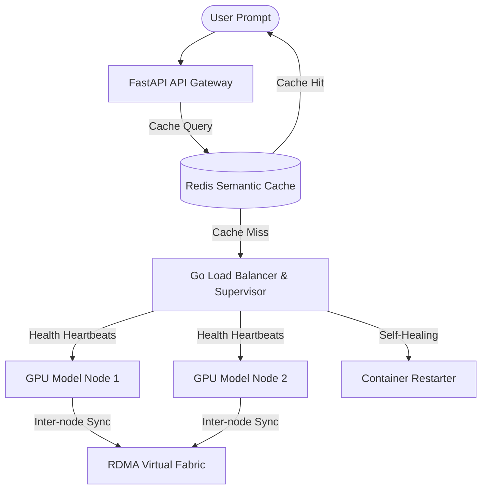

# FlynthAI-Grid: High-Performance Distributed LLM Orchestration & Middleware Gateway

[](https://golang.org)
[](https://fastapi.tiangolo.com)
[](https://nodejs.org)
[](https://opensource.org/licenses/MIT)
[](https://flynthai-grid-production.up.railway.app)

**FlynthAI-Grid** is an enterprise-grade distributed LLM control plane and middleware gateway designed to manage prompt orchestration, safety guardrails, caching optimization, and self-healing routing across remote GPU clusters.

Inspired by the clean, developer-first visual aesthetics of **Render.com**, FlynthAI-Grid features a flat, slate-themed telemetry dashboard mapping real-time hardware utilization (VRAM/CPU) and network routing configurations (GPUDirect RDMA zero-copy vs. TCP/IP fallback) via interactive canvas rendering.

---

## 🛠️ System Architecture

FlynthAI-Grid splits telemetry collection, prompt auditing, and request load-balancing into modular, specialized microservices:



---

## ✨ Core Features & Technical Stack

### 1. API Gateway & Guardrail Layer (FastAPI Engine)
- **PII Scrubbing**: Regex-based token sanitization immediately redacts connection strings, API keys, emails, and SSNs.
- **Toxicity & Injection Filters**: An ethical guardrail block scans prompts using character-frequency cosine similarity vectors (via **NumPy**) to capture adversarial injection payloads.
- **Redis Semantic Caching**: Caches previous inference outputs and performs semantic lookup. If Redis disconnects, it gracefully defaults to local in-memory NumPy caches.

### 2. Self-Healing Load Balancer (Go Node Router)
- **Pool Supervision**: Monitors inference nodes in parallel using concurrent health check loops (`GET /health`).
- **Zero-Downtime Failover**: Upon detecting a timeout or CUDA Out-of-Memory (OOM) log trace, the orchestrator immediately isolates the dead container, reroutes pending traffic to healthy nodes, and invokes container recovery.
- **Automated Container Recovery**: Triggers dynamic spin-up scripts to restore dead instances and seamlessly re-integrate them into the round-robin balance group.

### 3. Inter-Node GPUDirect RDMA Fabric (Go)
- **Zero-Copy Syncing**: Simulates InfiniBand Verbs (`ibv_mr`, `ibv_send_wr`) mapping PCIe memory addresses directly between GPU nodes.
- **Host CPU Staging Bypass**: Demonstrates direct VRAM peer-to-peer copies, bypassing the Host OS kernel stack and reducing execution latency.

### 4. Interactive Simulation & MLOps Telemetry (Node.js Console)
- **Render-Inspired UX**: Custom slate-gray (`#07080a`) and purple (`#8a05ff`) interface with sidebar navigation, clean metric counters, and rolling charts.
- **Live Terminal Buffers**: Emits logs from each active container over Server-Sent Events (SSE) on port `3500`.
- **Fault Injector**: Manually trigger CUDA OOM crashes, RoCE network congestion, or stress loads to inspect orchestrator failover response.

---

## 🗂️ Directory Structure

```text
flynthai-grid/
├── gateway/
│   ├── main.py                # FastAPI Python Gateway & cache/guardrail logic
│   ├── requirements.txt       # Python dependency declarations
│   ├── Dockerfile             # Container image configuration for gateway
│   └── nginx.conf             # Reverse proxy configuration
├── orchestrator/
│   ├── main.go                # Self-healing Go Load Balancer & cluster manager
│   ├── go.mod                 # Go module definition
│   └── Dockerfile             # Container build stages for orchestrator
├── simulator/
│   ├── rdma.go                # InfiniBand GPUDirect RDMA simulation verbs
│   └── mock_node.py           # Simulated GPU model serving endpoints
├── public/                    # Dashboard frontend asset files
│   ├── index.html             # Slate-themed interactive HTML console
│   ├── index.css              # Custom Render-like layout styles
│   └── app.js                 # HTML5 canvas graphics & telemetry consumer
├── docker-compose.yml         # Container networking and execution manifest
├── server.js                  # Node.js backend host serving SSE logs
├── package.json               # Node dev dependencies and start scripts
└── README.md                  # Project overview (this file)
```

---

## 🚀 Getting Started

### Standalone Local Setup

#### Prerequisites
* [Node.js](https://nodejs.org) (v18+)
* [Python](https://python.org) (v3.9+)
* [Go](https://go.dev) (v1.20+)

#### Steps
1. **Clone the Repository**:
   ```bash
   git clone https://github.com/your-username/flynthai-grid.git
   cd flynthai-grid
   ```
2. **Install Node Dependencies**:
   ```bash
   npm install
   ```
3. **Start the Telemetry Dashboard**:
   ```bash
   npm start
   ```
4. **Access the Application**:
   Open your browser and navigate to **[http://localhost:3500](http://localhost:3500)** (or access the live production deployment at **[https://flynthai-grid-production.up.railway.app](https://flynthai-grid-production.up.railway.app)**).

### Running with Docker Compose
To deploy the entire environment inside isolated networks:
```bash
docker-compose up --build
```

---

## 🎮 Interactive Simulation Walkthrough (Demo Guide)

Use this step-by-step guide to demonstrate the capabilities of the gateway (perfect for recordable video walkthroughs and LinkedIn showcases):

### 1. Test Semantic Cache
* Input `Audit cluster configuration for routing bottlenecks` in the Prompt Playground and click **Run Audits**. The pipeline runs step-by-step (approx. `1.8s` latency).
* Click **Run Audits** a second time. The query hits the cache, terminating instantly (`1ms`) and returning the cached response from the Redis console.

### 2. Test Safety Guardrail Block
* Check the **Simulate Toxic Payload** box and click **Run Audits**.
* The pipeline halts red at the **Guardrails** step.
* Switch to the **Console Logs** tab. The console will automatically scroll to the highlighted red warning trace and show a toast popup alert detailing the intercepted injection payload.

### 3. Test Automated Self-Healing
* In the dashboard, click **Crash Model Node-2**.
* Node-2 turns red (`OFFLINE`) and system health becomes `DEGRADED`.
* Watch the **Console Logs (Orchestrator)**. The Go orchestrator logs the loss of heartbeat, isolates the node, and routes 100% of pending traffic to Node-1.
* After 3 seconds, Node-2 status shifts to `RESTARTING` (yellow).
* At second 7, the node recovers automatically to `ONLINE` (green), re-joining the balance pool.

### 4. Test Staging CPU Overhead
* In the **Topology Grid** tab, hover over **Host OS**. You'll see CPU load sits at a flat `2%` because traffic bypasses it via direct RDMA.
* Switch to the dashboard, and toggle **RoCE Congestion** active.
* Return to the Topology Grid. The direct purple path is replaced by two dashed amber lines routing *through* the Host OS staging box. Hover over the **Host OS** node to see its CPU load spike to `58%+` due to standard TCP/IP copy staging.

---

## 📄 License

This project is licensed under the MIT License - see the [LICENSE](LICENSE) file for details.
